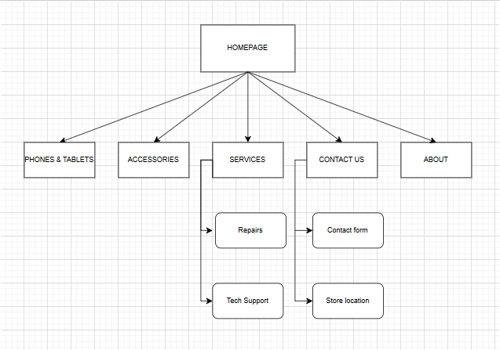

# Project Title
Lucky's Electronics

## Student Information
**Student number:** ST10513478  
**Student Name:** Itumeleng Mohloana

## Project Overview

A small business established in 2022 by a young South African man named lucky, who started off operating from the backroom of his father’s house to owning his first retail space. 
With the goal and vision to provide tech solutions to members in his community, from high school learners to college students, working professionals and those who just want their personal devices functioning as good as new at an affordable price without having to go the distance. 

## Website Goals and Objectives

The website title must be the business’s name in full to make it easy to find online. Customers must be able to buy covers, screen protecters, chargers and many more cellphone accessories. Fill in personal details and problems being expreinced with the cellphone, then get a reply via email or call for further discussion or confirmation consultation date. Have the option to trade in your phone for another depending on evaluation outcome. Create an account for discounts, latest updates on new arrivals, and to make purchases(istore.co.za).

## Timeline and Milestones

Week 1: Submission of research proposals.
Week 2: Peer to peer engagement, review and consultation with lecturer.
Week 3: Final proposal submission.
Week 4 - 5: Making changes based on lecturer feedback before continuation.
Week 6 – 7: Style website accordingly.
Week 8: Lecturer  and peers consultation followed by submission.

## Sitemap

(
## References

Istore, 2026. Available at:< iStore South Africa | South Africa's Widest Apple Range Online iStore South Africa | Buy Apple Products Online | Free Delivery>[Accessed 14 April 2026].